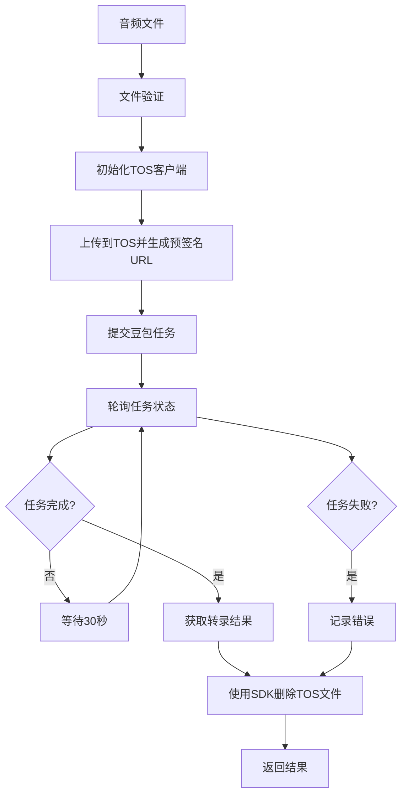

# 豆包录音文件识别（小模型版）使用指南

## 📋 功能概述

豆包录音文件识别（小模型版）是一个基于字节跳动豆包API的语音转文字服务，提供以下特性：

- ✅ **火山引擎TOS存储** - 自动上传音频文件到云端
- ✅ **异步任务处理** - 支持长音频文件处理
- ✅ **自动文件清理** - 任务完成后自动删除临时文件
- ✅ **智能重试机制** - 网络异常时自动重试
- ✅ **详细日志记录** - 完整的处理过程追踪

## 🔧 配置要求

### 1. 依赖安装

确保已安装必要的依赖包：

```bash
npm install @volcengine/tos-sdk
```

### 2. 环境变量配置

在 `.env.local` 文件中配置以下变量：

```bash
# 豆包录音文件识别API配置（小模型版）
DOUBAO_SMALL_APP_ID="2625161222"
DOUBAO_SMALL_TOKEN="d075400f-0024-4bcf-9dbb-400060a38735"
DOUBAO_SMALL_CLUSTER="volc_auc_common"
DOUBAO_SMALL_ENDPOINT="openspeech.bytedance.com"

# 火山引擎TOS对象存储配置
TOS_ACCESS_KEY_ID="your_access_key_id"
TOS_SECRET_ACCESS_KEY="your_secret_access_key"
TOS_REGION="ap-southeast-1"
TOS_BUCKET_NAME="stt-small-01"
TOS_ENDPOINT="tos-ap-southeast-1.volces.com"

# 语音服务选择
VOICE_SERVICE_PROVIDER="doubao-small"
```

### 3. 音频文件要求

- **格式**: MP3, WAV, OGG, MP4
- **大小**: 最大 512MB
- **时长**: 最大 5小时
- **编码**: 建议使用16kHz采样率，16bit位深

## 🚀 使用方法

### 1. 通过Web界面

1. 访问系统主页
2. 在设置中选择 "豆包录音文件识别（小模型版）"
3. 上传音频文件或提供音频URL
4. 等待处理完成

### 2. 通过API调用

```typescript
import { TaskProcessor } from '~/lib/services/task-processor';

const processor = TaskProcessor.getInstance();

// 处理音频文件
const result = await processor.processTask({
  type: 'AUDIO_TRANSCRIPTION',
  audioPath: '/path/to/audio.mp3',
  // ... 其他参数
});
```

### 3. 直接调用服务

```typescript
import doubaoSmallSTTService from '~/lib/services/doubao-small-stt';

// 直接转录音频文件
const transcription = await doubaoSmallSTTService.speechToText('/path/to/audio.mp3');
console.log('转录结果:', transcription);
```

## 🔍 服务状态检查

### 检查配置状态

```typescript
import { printConfigurationStatus } from '~/lib/services/doubao-small-stt-test';

// 打印配置状态
printConfigurationStatus();
```

### 测试服务连接

```typescript
import { testDoubaoSmallService } from '~/lib/services/doubao-small-stt-test';

// 测试服务状态
const isAvailable = await testDoubaoSmallService();
console.log('服务可用:', isAvailable);
```

## 📊 处理流程



## ⚙️ 高级配置

### 轮询策略

- **最大轮询次数**: 80次
- **轮询间隔**: 30秒
- **最大等待时间**: 40分钟
- **连续超时限制**: 5次

### 错误处理

服务包含完整的错误处理机制：

- **网络错误**: 自动重试
- **API错误**: 详细错误日志
- **文件错误**: 验证和提示
- **超时处理**: 优雅降级

### 文件清理

- **成功时**: 使用TOS SDK自动删除音频文件
- **失败时**: 同样清理临时文件
- **清理策略**: 不影响主流程的异步清理
- **预签名URL**: 自动过期（2小时），无需手动清理

### TOS SDK特性

- **官方SDK**: 使用火山引擎官方TOS SDK (@volcengine/tos-sdk)
- **自动重试**: SDK内置指数退避重试机制
- **进度监控**: 支持文件上传进度回调
- **错误处理**: 完善的TosClientError和TosServerError处理
- **预签名URL**: 安全的临时访问链接

## 🚨 故障排除

### 常见问题

1. **配置错误**
   ```bash
   ❌ 豆包小模型服务配置不完整: TOS_ACCESS_KEY_ID
   ```
   **解决方案**: 检查 `.env.local` 文件中的TOS配置

2. **网络连接问题**
   ```bash
   ❌ TOS上传失败: ECONNRESET
   ```
   **解决方案**: 检查网络连接和防火墙设置

3. **音频格式问题**
   ```bash
   ❌ 音频文件过大: 600MB (限制: 512MB)
   ```
   **解决方案**: 使用音频压缩功能或转换格式

### 调试模式

启用详细日志：

```typescript
import { Logger } from '~/lib/utils/logger';

// 设置日志级别
Logger.setLevel('debug');
```

## 📈 性能优化

### 音频预处理

建议使用系统内置的音频压缩功能：

```bash
# 在环境变量中启用音频压缩
AUDIO_COMPRESSION_ENABLED="true"
AUDIO_COMPRESSION_MAX_SIZE="80"  # MB
```

### 并发处理

系统支持并发处理多个音频文件：

```bash
# 设置最大并发任务数
MAX_CONCURRENT_TASKS="10"
```

## 📞 技术支持

如果遇到问题，请：

1. 检查配置文件和环境变量
2. 查看系统日志
3. 运行服务状态测试
4. 联系技术支持团队

---

*最后更新: 2024年 - 豆包录音文件识别（小模型版）服务*
