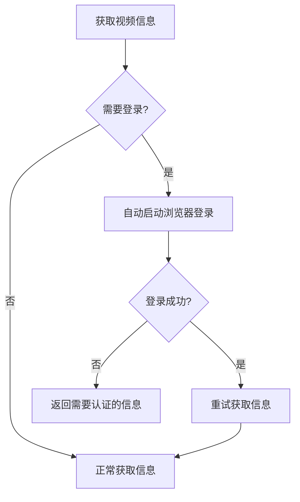
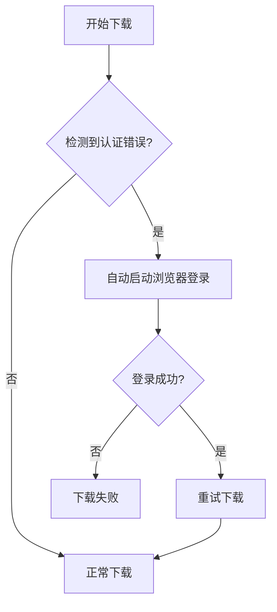
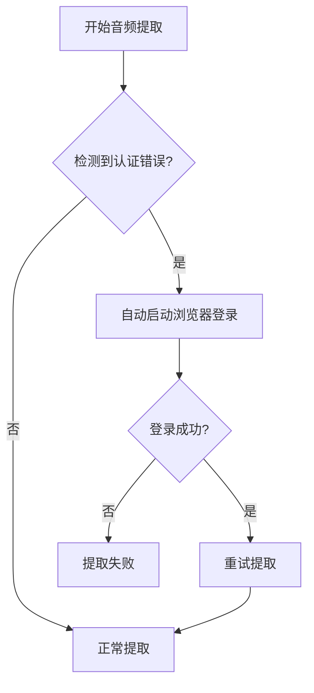

# 🤖 智能登录功能使用指南

## 🎯 功能概述

YT-DLP Service 现在具备**智能 YouTube 登录检测**功能！当系统检测到 YouTube 视频需要登录认证时，会自动弹出专用 Chromium 浏览器供您登录，无需手动干预。

## ✨ 智能特性

### 🔍 自动检测认证需求
系统会智能识别以下 YouTube 认证错误：
- `Sign in to confirm you're not a bot`
- `This video is unavailable`
- `Private video`
- `Members-only content`
- `Video unavailable`
- 其他需要登录的情况

### 🚀 自动响应流程
1. **检测错误** → 识别需要 YouTube 登录
2. **自动启动** → 打开专用 Chromium 浏览器
3. **用户登录** → 在弹出的浏览器中完成登录
4. **保存状态** → 自动保存登录信息
5. **重试任务** → 使用登录状态重新处理任务

## 🎮 使用场景

### 场景一：首次使用（推荐）
```
1. 启动应用 → 访问管理面板
2. 点击"手动登录" → 主动完成 YouTube 登录
3. 创建任务 → 享受无缝下载体验
```

### 场景二：智能响应（自动）
```
1. 创建 YouTube 任务
2. 系统检测到需要登录 → 自动弹出浏览器
3. 在专用浏览器中登录 → 任务自动重试成功
```

## 🔧 操作界面

### 管理面板新功能

访问 `http://localhost:3000/admin`，您会看到：

#### 📊 智能登录状态显示
- **✅ 已登录状态**：显示绿色提示"自动登录已就绪"
- **❌ 未登录状态**：显示需要登录的提示

#### 🎛️ 登录控制按钮
- **初始化浏览器**：准备专用 Chromium 环境
- **手动登录**：主动进行 YouTube 登录（推荐首次使用）
- **刷新登录状态**：检查并更新当前登录状态
- **关闭浏览器**：释放浏览器资源
- **测试浏览器**：验证浏览器功能是否正常

## 📋 完整工作流程

### 1. 视频信息获取阶段


### 2. 视频下载阶段


### 3. 音频提取阶段


## 🔄 智能重试机制

### 避免无限循环
- 每个阶段最多尝试一次自动登录
- 登录成功后，重试时不再尝试登录
- 防止多次弹出浏览器窗口

### 错误处理策略
- **认证错误** → 自动触发登录流程
- **网络错误** → 正常错误处理
- **视频不存在** → 直接失败，不触发登录

## 🛠️ 技术实现细节

### 错误检测模式
```typescript
private isYouTubeAuthError(errorMessage: string): boolean {
  const authErrors = [
    'Sign in to confirm you\'re not a bot',
    'Sign in to confirm',
    'This video is unavailable',
    'Private video',
    'Join this channel to get access',
    'Video unavailable',
    'Members-only content',
    'This video requires payment'
  ]
  
  return authErrors.some(authError => errorMessage.includes(authError))
}
```

### 自动登录处理流程
```typescript
private async handleYouTubeAuthRequired(): Promise<boolean> {
  // 1. 初始化浏览器管理器
  await browserManager.initialize()
  
  // 2. 检查现有登录状态
  const currentStatus = await browserManager.getLoginStatus()
  if (currentStatus.isLoggedIn) {
    return await browserManager.refreshLogin()
  }
  
  // 3. 创建新登录会话
  const session = await browserManager.createYouTubeSession()
  if (session.isLoggedIn) return true
  
  // 4. 启动交互式登录
  return await browserManager.promptForLogin()
}
```

## 📝 日志示例

### 智能登录触发时的日志
```
[INFO] Getting video info for: https://www.youtube.com/watch?v=xxxxx
[WARN] 检测到 YouTube 需要登录认证
[INFO] 🚀 自动启动 YouTube 登录流程...
[INFO] 创建新的 YouTube 登录会话...
[INFO] 🌐 正在打开专用浏览器，请在其中完成 YouTube 登录...
[INFO] ✅ YouTube 登录成功！登录状态已保存
[INFO] 🍪 登录信息已保存，可用于后续视频下载
[INFO] 登录成功，重试获取视频信息...
```

### 使用已有登录状态时的日志
```
[INFO] Getting video info for: https://www.youtube.com/watch?v=xxxxx
[INFO] 使用专用浏览器的 YouTube cookies
[INFO] Video info obtained: Video Title
```

## 🎯 最佳实践

### 1. 推荐首次使用流程
```bash
1. 启动应用：npm run dev
2. 访问管理面板：http://localhost:3000/admin
3. 点击"初始化浏览器"
4. 点击"手动登录"
5. 在弹出浏览器中完成 YouTube 登录
6. 确认看到"自动登录已就绪"提示
7. 开始创建和处理 YouTube 任务
```

### 2. 日常使用
- ✅ 直接创建 YouTube 任务
- ✅ 系统会自动处理认证需求
- ✅ 只在必要时才会弹出登录窗口

### 3. 故障排除
- 如果登录失败，在管理面板点击"刷新登录状态"
- 如果浏览器异常，点击"关闭浏览器"后重新"初始化浏览器"
- 检查日志以了解具体的错误信息

## 🚨 注意事项

### 开发环境 vs 生产环境
- **开发环境**：显示浏览器窗口，便于交互登录
- **生产环境**：Headless 模式，需要预先配置或使用 X11 转发

### 安全考虑
- 专用浏览器与您的主浏览器完全隔离
- 登录信息只保存在专用数据目录中
- 不会影响您的主浏览器账户和数据

### 性能影响
- 只在检测到认证错误时才启动浏览器
- 登录状态会持久保存，避免重复登录
- 任务失败时会自动清理临时资源

## 🎉 总结

智能登录功能让您可以：
- 🤖 **自动化**：无需手动判断何时需要登录
- 🔒 **安全性**：专用浏览器隔离保护隐私
- 🚀 **便捷性**：一次登录，持续使用
- 🛡️ **可靠性**：智能重试和错误处理

现在您可以专注于创建任务，让系统智能地处理所有认证需求！🎯 